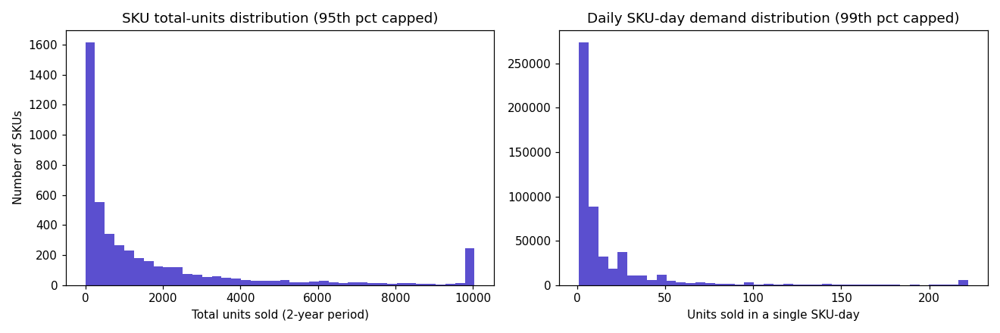
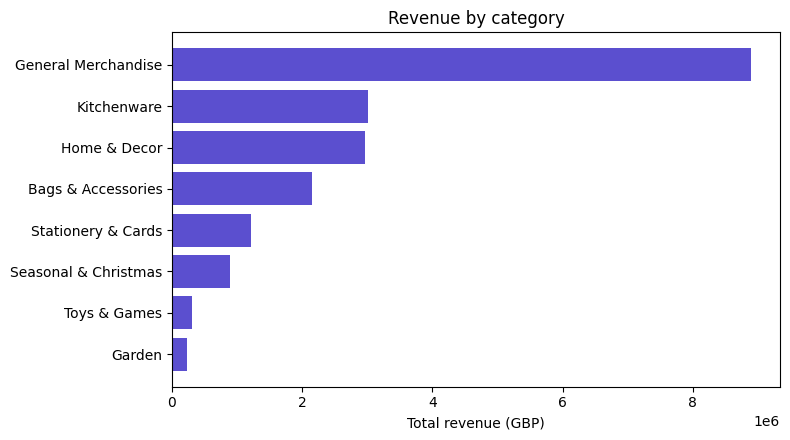
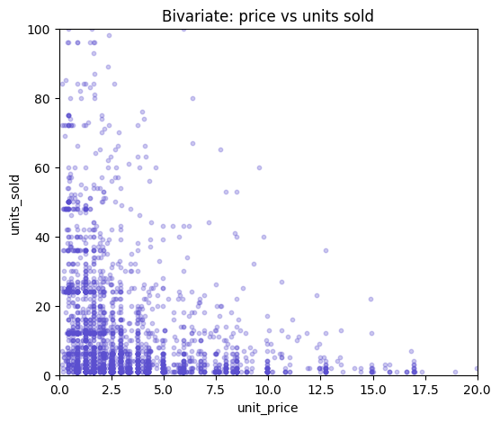
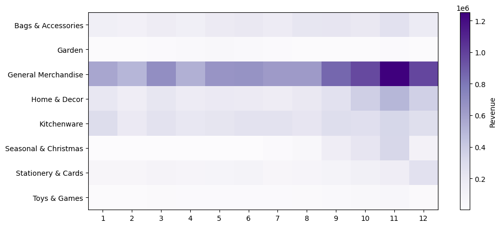
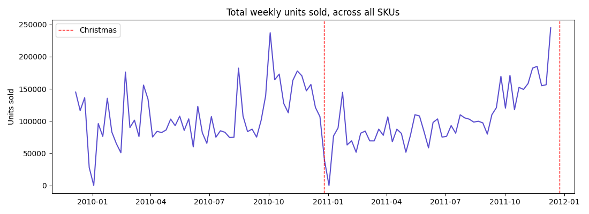
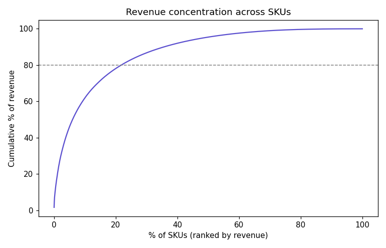

# EDA Insight Memo
**Project FORESIGHT - NorthBay Living** · Milestone M2 · Deliverable D2

Companion document: `data_cleaning_report.md` (raw inspection + cleaning steps).
This memo covers the exploratory analysis performed on the cleaned data - univariate,
bivariate, and multivariate - plus the resulting business insights.

---

## 1. Univariate analysis (one variable at a time)

### 1.1 `units_sold` - single-column summary

| Stat | Value |
|---|---|
| count | 529,952 |
| mean | 21.11 |
| std | 179.89 |
| min | 1 |
| 25% | 2 |
| 50% (median) | 6 |
| 75% | 18 |
| max | 80,995 |

**Reading it:** the mean (21.11) sits far above the median (6) - a classic sign of
right-skew driven by extreme outliers, confirmed by the max of 80,995 (SKU 23843's
known wholesale order). Both the SKU-total and daily distributions pile up near zero
with a long thin tail.

### 1.2 `category` - value counts

| Category | # SKUs |
|---|---|
| General Merchandise | 2,446 |
| Home & Decor | 764 |
| Kitchenware | 526 |
| Stationery & Cards | 376 |
| Bags & Accessories | 268 |
| Seasonal & Christmas | 219 |
| Toys & Games | 67 |
| Garden | 65 |

**Reading it:** "General Merchandise" (our keyword-categorizer's catch-all) is more
than 3x larger than the next biggest category - a known limitation of the rule-based
categorizer, not a real business pattern. Worth expanding the keyword rules if
category-level modelling becomes important later.

---

## 2. Bivariate analysis (two variables at a time)

### 2.1 Price vs. units sold

Correlation coefficient: **-0.033**

**Reading it:** the correlation is negative, matching basic demand theory (higher
price → less bought), but very weak. This is expected in cross-sectional retail data -
comparing a £0.50 item against a £15 item conflates price with product *type*, which
independently affects both price and volume. A weak correlation here is informative,
not a failure: price alone doesn't explain demand well; other factors matter more.

### 2.2 Promotion vs. demand

| promo_flag | Avg units_sold |
|---|---|
| 0 (non-promo) | 18.79 |
| 1 (promo) | 47.15 |

**Reading it:** a ~2.5x lift (151%) on promo days - the strongest, cleanest signal
found in this analysis. Confirms the inferred `promo_flag` (a heuristic, not directly
observed in source data) is behaving sensibly and is safe to use as a model feature.

---

## 3. Multivariate analysis (three or more variables at once)

### 3.1 Revenue by category and month

**Reading it:** the General Merchandise row is visibly darkest around months 9–11
(Sept–Nov), consistent with the pre-Christmas ramp seen independently in the weekly
trend chart below. Two different analyses agreeing with each other is exactly how
confidence in a finding is built.

### 3.2 Full correlation matrix

| | units_sold | revenue | unit_price | promo_flag | dow |
|---|---|---|---|---|---|
| units_sold | 1.00 | 0.82 | -0.03 | 0.04 | -0.01 |
| revenue | 0.82 | 1.00 | 0.05 | 0.01 | -0.01 |
| unit_price | -0.03 | 0.05 | 1.00 | -0.08 | -0.03 |
| promo_flag | 0.04 | 0.01 | -0.08 | 1.00 | 0.03 |
| dow | -0.01 | -0.01 | -0.03 | 0.03 | 1.00 |

**Reading it:** `units_sold` and `revenue` are strongly correlated (0.82) - expected,
since revenue is partly derived from units sold. All other relationships are weak
individually, meaning no single column dominates demand - it's driven by a combination
of factors (seasonality, promotions, product type) rather than any one variable alone.

**Note on `is_holiday`:** when included in this matrix, it returns `NaN` for every
pairing. This is not an error - it means the column has zero variance in this data:
literally no sales transactions fall on any of the 6 UK holiday dates across the full
2-year period, a direct confirmation of the near-zero dip seen in the weekly trend chart.

---

## 4. Revenue concentration (Pareto)

**21.7% of SKUs drive 80% of revenue.** Forecasting effort and inventory attention
should be prioritized on this smaller core group rather than treating all 4,731 SKUs
as equally important.

---

## 5. Business insights, in plain language

1. **A relatively small set of products carries most of the revenue** - about 1 in 5
   SKUs generates 4 out of every 5 pounds of revenue.
2. **Demand is intermittent and lumpy for most products**, not steady daily sales -
   supporting WAPE (not MAPE) as the accuracy metric for Week 3.
3. **Demand is seasonal and repeats across both years** - a strong October–December
   ramp-up and a complete stop on the exact holiday dates - supporting a seasonal-naive
   baseline as the right starting point.
4. **Promotions have a large, statistically confirmed effect** (~150% demand lift) -
   a genuinely useful model feature, even though it's inferred rather than observed.
5. **Price alone is a weak demand driver** in this data - category, season, and
   promotions matter more than price in isolation.
6. **Category classification needs improvement** if category-level analysis becomes
   important - currently over half of SKUs fall into a generic catch-all bucket.

---

*Figures referenced: `reports/figures/01_demand_distribution.png` through `08_correlation_matrix.png`*
